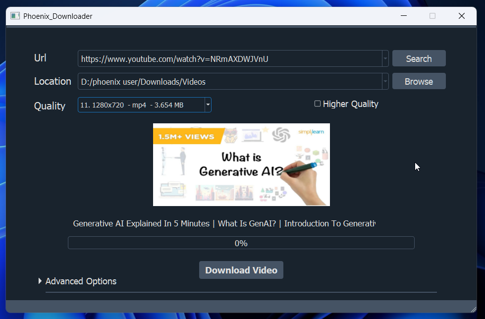
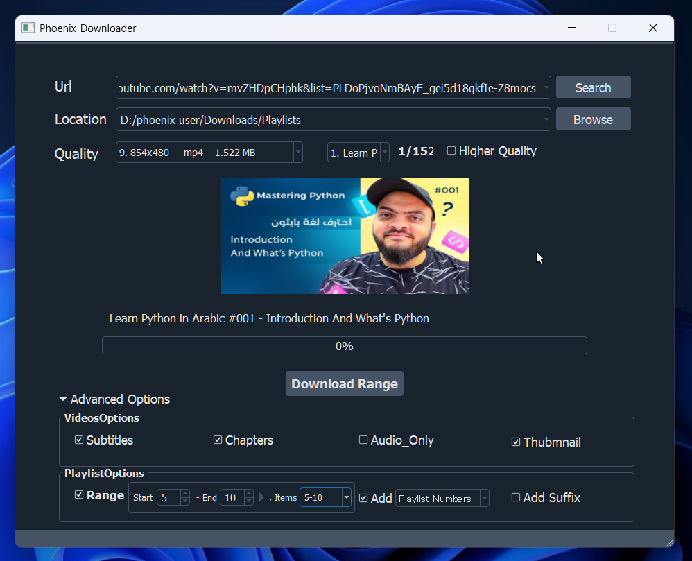
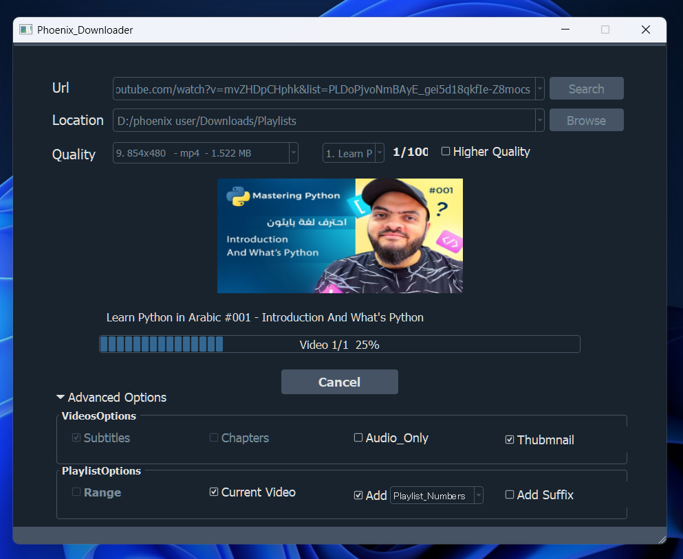
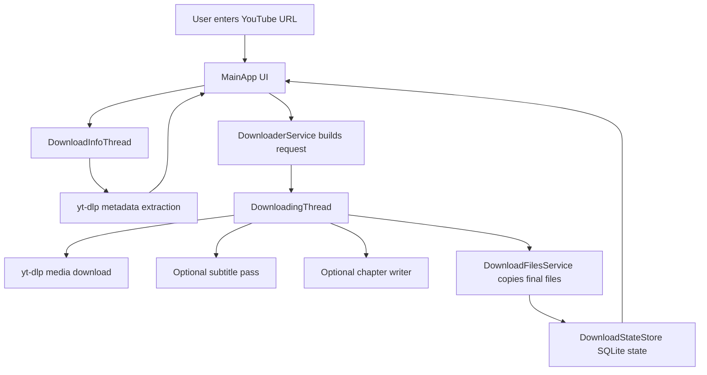

# Phoenix Downloader

> A PyQt5 desktop downloader for YouTube videos, audio, and playlists. Built around `yt-dlp`, with playlist range selection, optional subtitles and chapter files, SQLite persistence, resumable temp caching, structured logging, and automated tests.


## Preview

### Main Window



### Playlist Mode



### Download Progress



## Overview

Phoenix Downloader is a Windows-oriented desktop app that makes common `yt-dlp` workflows easier through a GUI. It can inspect a YouTube URL, show available formats, download a single video, download a full playlist, download only the current playlist video, or download a custom playlist range.

This project started as an older working downloader and was later refactored into a more maintainable Python application. The current version separates UI, worker threads, services, repositories, models, core helpers, and tests.

## Features

- Single video download with quality selection
- Full playlist, current playlist video, and custom range download modes
- Mixed `watch?v=...&list=...` URL handling with current video auto-selection
- Audio-only mode
- Optional subtitle download with manual/auto fallback passes
- Optional PotPlayer `.pbf` chapter file generation
- Thumbnail preview and video metadata loading
- Recent URL and folder history
- AppData temp workspace for safer resume/reuse behavior
- SQLite-backed download state and app settings
- Reuse of already downloaded files when possible
- Log file for debugging real failures without exposing noisy errors to users
- Pytest coverage for helper logic, playlist rules, file rules, yt-dlp options, and SQLite stores

## Highlights

- Built as a desktop GUI layer over `yt-dlp` for easier everyday use
- Supports playlists, current-video-only mode, and manual range selection
- Uses SQLite for local state and history instead of flat app-only memory
- Keeps subtitle failures optional so the main video download can still succeed
- Refactored from an older codebase into clearer services, repositories, workers, and helpers

## How It Works



The main video download is treated as the primary success path. Subtitle and chapter work is optional, so subtitle rate limits or missing captions should not mark the whole video download as failed.

## Project Structure

```text
Phoenix_Downloader/
├── app/
│   ├── core/              # database setup, logging setup, yt-dlp helpers
│   ├── models/            # dataclasses used between UI/workers/services
│   ├── repositories/      # SQLite-backed state/settings stores
│   ├── services/          # download workflow and file operations
│   ├── ui/                # PyQt5 main window and generated UI resources
│   ├── utils/             # pure helper functions
│   └── workers/           # QThread-based info and download workers
├── docs/
│   └── assets/
│       └── screenshots/   # README screenshots
├── tests/                 # pytest test suite
├── LICENSE
├── main.py                # application entrypoint
├── requirements.txt
└── README.md
```

## Skills Demonstrated

| Area | What this project shows |
| --- | --- |
| Desktop GUI | PyQt5 widgets, Qt signals, background workers, responsive UI state |
| Concurrency | `QThread`, Python threads, progress hooks, safe UI updates |
| Download integration | `yt-dlp` format selection, playlist handling, subtitle/chapter workflows |
| Persistence | SQLite schema, repositories, settings/history storage, interrupted-state recovery |
| File workflow | temp workspace, final copy, old temp cleanup, reuse of completed downloads |
| Error handling | user-friendly messages, optional subtitle failure flow, internal logs |
| Testing | pytest tests for helpers, services, repositories, and yt-dlp option building |
| Refactoring | split from large UI/worker files into services, repositories, models, and core helpers |

## Requirements

- Python 3.10+
- Windows recommended/tested
- FFmpeg available in `PATH` for reliable media merge and subtitle handling
- A signed-in browser session can help when some metadata requests require authentication

Install FFmpeg separately if it is not already available on your system.
For content you are authorized to access, keep YouTube signed in on Edge, Chrome, Firefox, or Brave if metadata extraction needs an existing browser session.

## Setup

```bash
python -m venv venv
venv\Scripts\activate
python -m pip install -r requirements.txt
```

## Run

```bash
python main.py
```

## Test

```bash
python -m pytest tests
```

Optional syntax check:

```bash
python -m compileall app tests
```

## Local Data

Runtime data is stored under Local AppData:

```text
%LOCALAPPDATA%\PhoenixDownloader\
├── phoenix_downloader.db
├── logs\app.log
└── temp_media\
```

These files are intentionally ignored by Git.

## Usage Notes

- For a normal video URL, the app loads video metadata and available qualities.
- For a playlist URL, the app loads playlist entries and lets you choose full playlist, current video, or a custom range.
- For a mixed `watch?v=...&list=...` URL, the app opens playlist mode and selects the current video by default.
- For content you are authorized to access, the app can retry metadata loading with an existing browser session when authentication is required.
- Subtitle failures such as HTTP 429 are treated as optional; the video can still finish successfully.
- If a merge or conversion fails, check that FFmpeg is installed and available in `PATH`.

## Responsible Use

Phoenix Downloader is intended for content you own, content you have permission to download, or content where downloading is allowed by the service, license, or applicable law. The repository does not include downloaded media.

## Known Limitations

- The app is mainly tested on Windows.
- The UI design is still based on the original desktop layout; the refactor focused on reliability and maintainability.
- YouTube subtitle requests can be rate-limited by YouTube or `yt-dlp`.
- Packaging with PyInstaller is not included yet.

## Roadmap Ideas

- Add packaged Windows release with PyInstaller
- Add a short demo GIF
- Add more tests for edge-case playlist and filesystem behavior
- Later project stage: modern UI refresh or `pathlib` migration if needed

## License

This project is licensed under the [MIT License](LICENSE).
